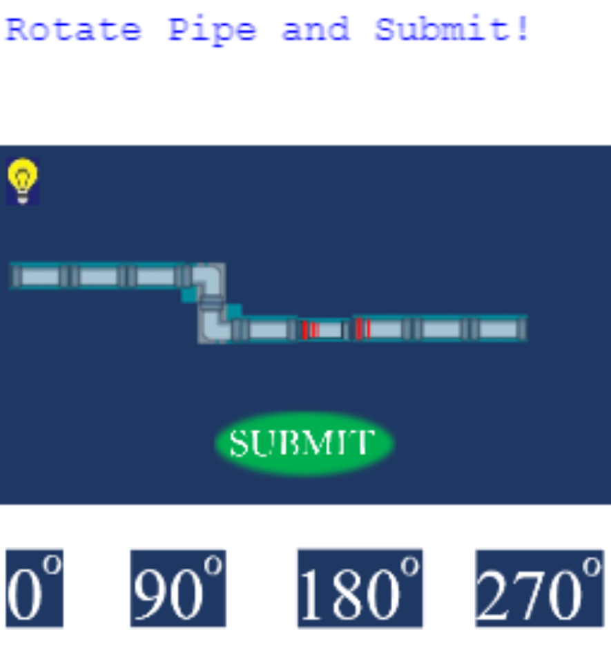

# Game Name
Angles Master
# Elevator Pitch
This game teaches the important concept of angles to the user through a series of fun and entertaining puzzles. Each puzzle presents a pipe with a missing segment.  The player must correctly rotate the unconnected pipe so that it links the entire pipe together.  Upon selecting the correct angle which the missing pipe piece should be rotated at, the user gets to hear a funny and happy noise.  Answering incorrectly, means that the user will hear a grumpy noise.

# Basic Instructions
The player should select the tutorial first.  Going through the tutorial will get the user comfortable with the gameplay.  After completing the tuorial the user is ready for level 1.  The user should click the 0, 90, 180 or 270 button in order to orient the missing pipe piece in the desired way and then click submit.

# large image

# Gameplay Link
https://www.youtube.com/watch?v=WMFAL796Yyw&feature=youtu.be
