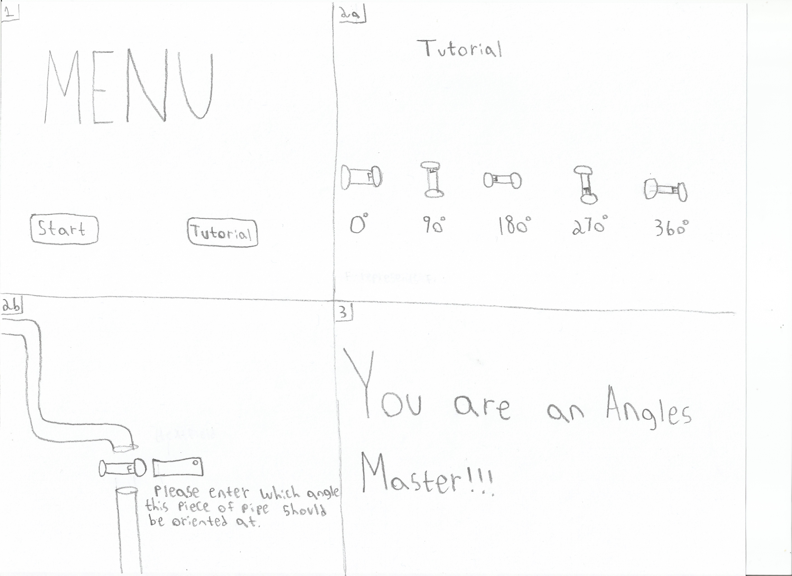

# AnglesMaster

## Elevator Pitch

*This game teaches the important concept of angles to the user through a series of fun and entertaining puzzles. Each puzzle presents a pipe with a missing segment. The player must correctly rotate the unconnected pipe so that it links the entire pipe together. Upon selecting the correct angle which the missing pipe piece should be rotated at, the user gets to hear a funny and happy noise. Answering incorrectly, means that the user will hear a grumpy noise.*

## Influences (Brief)

- *Plumber Pipe:*
  - Medium: *Game*
  - Explanation: *Plumber pipe is set in a similar environment to this game in which the player is trying to connect the pipes in a way so that water can freely flow from a starting point to a desired destination.*
- *Kitten Cannon:*
  - Medium: *Game*
  - Explanation: *Kitten Cannon provides the player with instant feedback as to what launching angles are conducive to propelling the kitten the furthest.  Likewise this game gives the player instant feedback as to which angles of work and which angles don’t.*

## Core Gameplay Mechanics (Brief)
- *Connect the left segment of pipe with the right segment of pipe by selecting a numeric value representing the angle the missing piece should be oriented at*
- *Correct and Incorrect noises*
- *After completing so many questions answers a message is displayed*

# Learning Aspects

## Learning Domains

*The main domain we are targeting is Math, specifically angles.*

## Target Audiences

- *Our target audience would be students that are at the point in their math curriculum where they are studying angles.* 
- *It is appropriate for all ages.*

## Target Contexts

- *This game could be assigned as an additional practice in a Math course which has angles as part of its curriculum.*
- *It may not be conducive for students to play this game in school because of its audio component.*

## Learning Objectives

- *Associate angles with images*: *By the end of the lesson, players will be able to identify objects oriented at different degrees by their image (Degrees can vary anywhere from 0 - 270).*
- *Select angles in order to solve problems*: *By the end of the lesson, players will be able to identify which angle an object should be oriented at in order to meet criteria, such as solve a puzzle.*

## Prerequisite Knowledge

- *Simple Math (Addition and Subtraction)*
- *Basic understanding of degrees (360 in a circle, etc)*

## Assessment Measures

*A short pre/post test would be the best way to test students:*
- *Find the angle of x with all other angles in a shape given.*
- *What are the total degrees in a circle? Square? Etc…*
- *Given an image of an object identify the angle that it is oriented at.*

# What sets this project apart?

- *Most ways to learn how to find the angle of something is the teacher sitting there and explaining it to you, which kids can find boring. This at least adds more excitement to the little kids lives.*
- *There are fun graphics and audio associated with learning the material.*

# Player Interaction Patterns and Modes

## Player Interaction Pattern
This game is for one player, they type with the keyboard.

## Player Modes

- *Start Screen:* *Choosing to begin the game or start tutorial (if time permitting)*
- *Tutorial:* *Following along on a simple level to learn how to play*
- *Level:* *Each level will be different but increases in difficulty and played individually*

# Gameplay Objectives

- *Connect the pipes in a way so that water can flow freely across the screen*:
    - Description: *Select the angle which the missing piece of pipe should be facing*
    - Alignment: *In order for the segments of pipes to be properly connected you must understand which angle the missing piece needs to be oriented at.  When this happens you get credit towards advancing to the next level.*

# Procedures/Actions

*The player will click on the button associated with the an angle representing the orientation of the missing pipe piece.*

# Rules
- *The player must go through the tutorial before going onto level1*
- *If the player gets the number wrong, they will get an auditory response from the game*
- *If the player gets the number right, they will get an auditory response from the game*
- *A noise will be played when the player finsihes the level* 
- *Correct answers will start out simple (ex 90, 180, 270) but get increasingly more challenging*

# Objects/Entities

- *Images for the pipes at different angles*
- *Sounds and a background*
- *Tutorial round to introduce the game*

## Core Gameplay Mechanics (Detailed)

- *Rotating the missing pipe piece*: *Select a numeric value representing the angle to rotate the pipe piece by clicking. Then the pipe piece will be rotated to the entered angle.*
- *Correctly orienting the missing pipe piece*: *If you enter the correct angle then you will get auditory feedback and will make progress towards advancing in the game.*
- *Incorrectly orienting the missing pipe piece*: *If you enter the correct angle then you will get auditory feedback and be asked to try again.*
- *If you answer X Correct angles*: *If you enter X correct angles then the game will progress to the next level which will require the player to recognize additional angles besides 90, 180 and 270 degrees.*
- *All levels complete*: *After all the levels are complete, a victory message appears*
    
## Feedback

- *Sounds and text are used when the player gets a question right or wrong which will cause a positive or negative affect*
- *“Level X/N” will show how close the player is to finishing the game (X = current level, N = total levels)*

# Story and Gameplay

## Presentation of Rules

*A tutorial is an option that can be chosen on the menu screen for a new player to learn how to play the game..*

## Presentation of Content

*By completing each level, they are practicing finding an angle that would match the shape they are looking at*

## Story (Brief)

*The water needs to get to a city in desperate need of the water, and only by fixing the pipes below the ground will it get there.*

## Storyboarding

 

-*Note in 2a, an F is marked on the front of the pipe to distinguish between 90 and 180 degrees.*
-*Note in 2b the rectangle directly above the word “Please” is a textfield.*

# Assets Needed

## Aethestics

*Since this is more of a children’s game, it should feel very happy and cartoony. Silly characters and happy background music should make the game feel fun and light-hearted.*

## Graphical

- Characters List
  - *City: People in the city that get fresh water at end of game*
- Textures:
  *N/A*
- Environment Art/Textures:
  - *Background image: made to seem like the pipes are underground*
  - *Pipes: Placed in different spots to show the correct answer*
  - *Text Box: Place where the player puts their answer*

## Audio

- Music List (Ambient sound)
  
  
- Sound List (SFX)
  - *Correct answer*: *Mario Yippie Sound*
  - *Incorrect answer*: *Mario sound*

# Metadata

- *Template created by Austin Cory Bart <acbart@udel.edu>, Mark Sheriff, Alec Markarian, and Benjamin Stanley.*
- *Version 0.0.3*
- *Matt Vermont and Daniel Warszawski Version 0.0.1*
